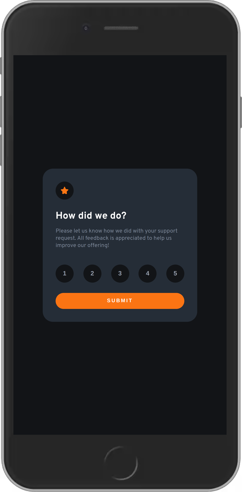

# interactive-rating-component---Frontend-Mentor

Simple interactive rating component from Frontend Mentor

# Frontend Mentor - Interactive rating component solution

This is a solution to the [Interactive rating component challenge on Frontend Mentor](https://www.frontendmentor.io/challenges/interactive-rating-component-koxpeBUmI).

## Table of contents

- [Links](#https://hombreombre.github.io/interactive-rating-component---Frontend-Mentor/)
- [My process](#my-process)
- [Built with](#HTML, CSS, JS)
- [Author](#HombreOmbre)

### The challenge

Users should be able to:

- View the optimal layout for the app depending on their device's screen size
- See hover states for all interactive elements on the page
- Select and submit a number rating
- See the "Thank you" card state after submitting a rating

### Screenshot

### Links

- Solution URL: [https://hombreombre.github.io/interactive-rating-component---Frontend-Mentor/]

### Built with

- Semantic HTML5 markup
- CSS custom properties
- Flexbox
- CSS Grid
- JavaScript

## Author

- Frontend Mentor - [@HombreOmbre](https://www.frontendmentor.io/profile/HombreOmbre)
